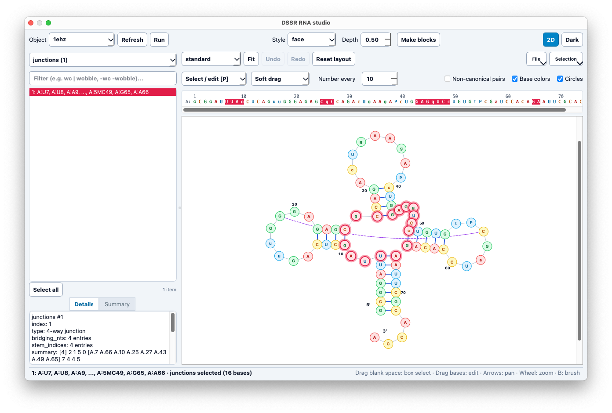

# DSSR-PyMOL: Interactive RNA 2D Layout Studio & 3D Visualization

**DSSR-PyMOL** is an integrated PyMOL plugin that bridges 3D structural analysis, stylized cartoon block modeling, and an interactive pure-Python RNA 2D layout studio. Powered by
[DSSR](https://doi.org/10.1093/nar/gkv716) (Dissecting the Spatial Structure of RNA), the plugin allows structural biologists to explore, identify, select, and edit secondary/tertiary nucleic acid features seamlessly in real time.



---

### Key Features

* **Interactive 2D RNA Layout Studio (`dssr_2d`)**:
  * Pure-Python, dependency-free layout engine ported from the JavaScript NAView loop-decomposition implementation in ViennaRNA/fornac (`naview.js`).
  * Multiple layout projections: **Standard NAView**, **Circular**, **Linear (arc)**, and **Radiate**.
  * Automated tRNA cloverleaf topology recognition and standardized orientation (acceptor stem pointing down, anticodon arm pointing up).
  * Direct visualization of non-canonical (non-WC/Wobble) base pairs as curved tertiary arcs.
* **Bi-directional 2D ⟷ 3D Selection Linking**:
  * Interactive canvas picking (click, box select, or brush tool `B`) mirrors directly to PyMOL 3D viewport selections.
  * Real-time 3D-to-2D synchronization: selections made in PyMOL are reflected back onto the 2D layout nodes and 1D sequence ruler.
  * Interactive diagram editing with soft dragging, base-pair, loop, stem, and branch kinematic manipulation, backed by a full undo/redo stack (`Ctrl+Z` / `Ctrl+Y`).
* **1D Sequence Ruler**:
  * Full sequence display separated by chain boundaries, aligned above an authentic residue numbering ruler.
  * Supports click-and-drag range selection, shift-extending, and Ctrl-toggling directly linked to 3D and 2D highlights.
* **3D Schematic Base Blocks (`dssr_block`)**:
  * Generate customizable rectangular block cartoons (Watson-Crick face, minor groove edge, G-tetrads, and more) natively in PyMOL via DSSR.
* **Feature Browser & Search**:
  * Query DSSR-detected structural features: base pairs, stems, helices, hairpins, bulges, internal loops, junctions, pseudoknots, A-minors, stacks, G-quadruplexes, and U-turns.
  * Filter motifs with boolean queries (`wc | wobble`, `-wc`) and inline clear functionality.
* **Publication-Quality Export**:
  * Export 2D diagrams directly to vector **SVG** or high-resolution **PNG**.
  * Save and reload edited 2D coordinates (`.dssr2d.json`) or copy Dot-Bracket Notation (`.dbn`) directly to the clipboard.

---

### Installation & Requirements

#### Requirements
1. **PyMOL**: Modern PyMOL (v2.x or v3.x, Open-Source or Incentive build) with Python 3 and PyQt5/PyQt6.
2. **DSSR (`x3dna-dssr`)**: The `x3dna-dssr` command-line executable must be installed and accessible in your system `PATH` (or configured via the plugin).
   * Available from [Columbia Technology Ventures](https://inventions.techventures.columbia.edu/technologies/dssr-an-integrated-software--CU20391).

#### Installation
1. Download `dssr_select.py` from the root of this repository.
2. In PyMOL:
   * **Direct execution**: Run `run /path/to/dssr_select.py` in the PyMOL command line.
   * **Permanent installation**: In the PyMOL menu, go to **Plugin** → **Plugin Manager** → **Install New Plugin** → **Choose file...** and select `dssr_select.py`.
3. Once loaded, launch the interface via **Plugin** → **DSSR** or type `dssr_gui` in the PyMOL command line.

---

### Quick Start Demo (1-Minute Tour)

Run the following commands in the PyMOL command line:

```text
fetch 1ehz
as cartoon
dssr_gui
```

1. **2D Studio**: The RNA 2D diagram automatically generates using the standard NAView tRNA cloverleaf layout alongside the 1D sequence ruler.
2. **Selection Linking**: Drag a box around the anticodon loop in the 2D view; the corresponding residues are immediately selected and highlighted in pink in PyMOL's 3D viewport.
3. **Make Blocks**: Click the **Make blocks** button in the top toolbar to generate a schematic 3D block representation for the entire structure.
4. **Theme**: Click the **Dark** toggle button to switch between light and dark workstation themes.

---

### Command-Line Interface (CLI)

All core functions can be scripted or invoked directly from the PyMOL console:

#### 1. Interactive 2D Studio (`dssr_2d`)
Syntax: `dssr_2d [ selection [, state [, layout [, number_every [, show_noncanonical [, title [, export ]]]]]]]`

Examples:
* `dssr_2d 1ehz`
* `dssr_2d 1ehz, 1, circular, show_noncanonical=1`
* `dssr_2d 1ehz, layout=circular, show_noncanonical=1`
* `dssr_2d 1ehz, number_every=5`

#### 2. Feature Selection (`dssr_select`)
Syntax: `dssr_select [ selection [, state [, feature [, index [, name ]]]]]`

Supported features: `pairs`, `stems`, `helices`, `hairpins`, `bulges`, `iloops`, `junctions`, `pseudoknot`, `gquadruplexes`, `uturns`, `aminors`, `stacks`, etc.

Examples:
* `dssr_select 1ehz, stems, 1`
* `dssr_select 1ehz, hairpins, 1, name=anticodon_loop`
* `dssr_select 1ehz, helices, 0`

#### 3. Stylized Base Blocks (`dssr_block`)
Syntax: `dssr_block [ selection [, state [, block_file [, block_depth [, block_color [, name [, exe ]]]]]]]`

Supported styles (`block_file`): `face`, `edge`, `wc`, `g4`, `imotif`, `minor`, `equal`, etc.

Examples:
* `dssr_block 1ehz`
* `dssr_block 1ehz, block_file=wc-minor, block_depth=0.5`

---

### Keyboard Shortcuts in 2D Studio

| Key / Action | Function |
| :--- | :--- |
| **Click / Drag Blank** | Box selection of nucleotides |
| **Drag Bases** | Move bases according to the active drag mode |
| **Shift + Click / Drag** | Add to selection |
| **Ctrl + Click** | Toggle individual selection |
| **B** | Toggle Brush selection tool |
| **P** | Switch back to Select / Edit tool |
| **1 – 6** | Switch drag modes: `base`, `selection`, `pair`, `loop`, `stem`, `branch` |
| **F** | Fit entire 2D diagram to view |
| **C** | Center and fit selected bases |
| **Ctrl + Z / Ctrl + Y** | Undo / Redo 2D layout edits |
| **Arrow keys** | Pan view (Hold `Shift` for faster pan) |
| **Mouse Wheel** | Zoom in / out under cursor |
| **Esc** | Clear selection in 2D studio, sidebar, and PyMOL |

---

### Project Heritage & Contributions

* **Conceived, directed, and actively co-developed by**: Xiang-Jun Lu, including core architecture, ongoing refactoring, bug fixes, and feature integration.
* **Interactive Qt GUI & 2D Studio (`dssr_gui`, `dssr_2d`)**: Eric Chen, who created the initial Qt graphical interface, engineered the interactive pure-Python 2D RNA studio, and integrated `dssr_block`.
* **Structural feature selection, JSON parsing & architectural development**: Bener Dulger, who designed the initial structural feature selection and JSON parsing, and drove ongoing feature development, architectural refactoring, and documentation.
* **Original 3D block cartoon logic (`dssr_block`)**: Thomas Holder (Schrödinger LLC).
* **Inspiration & Algorithmic Foundation**: Prof. Robert M. Hanson (Jmol/VARNA integration) and the [ViennaRNA/fornac](https://github.com/ViennaRNA/fornac) project.

---

### How to Cite

If you use this plugin in your research, please cite it as follows:

**Software Citation**

> Eric Chen, Bener Dulger, and Xiang-Jun Lu. **dssr_select: A PyMOL plugin for interactive RNA/DNA structural feature selection and visualization.** (2026). Available at: https://github.com/xiang-jun/dssr-pymol

**Core Technology Citation**

> Lu XJ, Bussemaker HJ, Olson WK (2015). **DSSR: an integrated software tool for dissecting the spatial structure of RNA.** *Nucleic Acids Research*, 43(21), e142.

---

### Funding & Acknowledgments

* **NIH Grant Support**: This project is supported by the **National Institutes of Health (NIH)** grant **R24GM153869** on *X3DNA-DSSR, an NIGMS National Resource for Structural Bioinformatics of Nucleic Acids*.
* **3D Base-Block Schematics (`dssr_block`)**: This plugin incorporates components from the `dssr_block` plugin by Thomas Holder (© Schrödinger LLC).
* **2D RNA Layout Engine (`ViennaRNA/fornac`)**: The pure-Python, dependency-free 2D layout engine was adapted from the NAView loop-decomposition algorithm in [ViennaRNA/fornac](https://github.com/ViennaRNA/fornac) (Peter Kerpedjiev, Stefan Hammer, and Ronny Lorenz; Apache-2.0).

---

### License

This project is released under the [BSD 2-Clause License](LICENSE).
